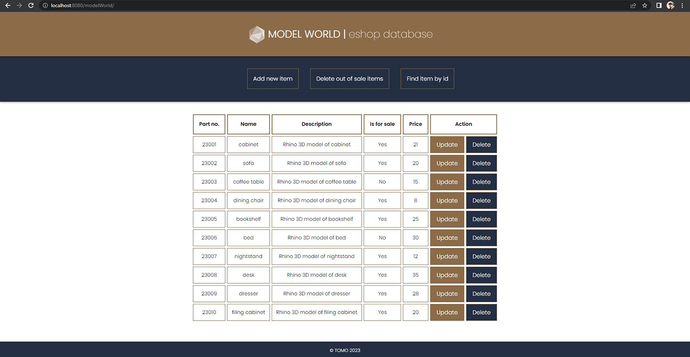
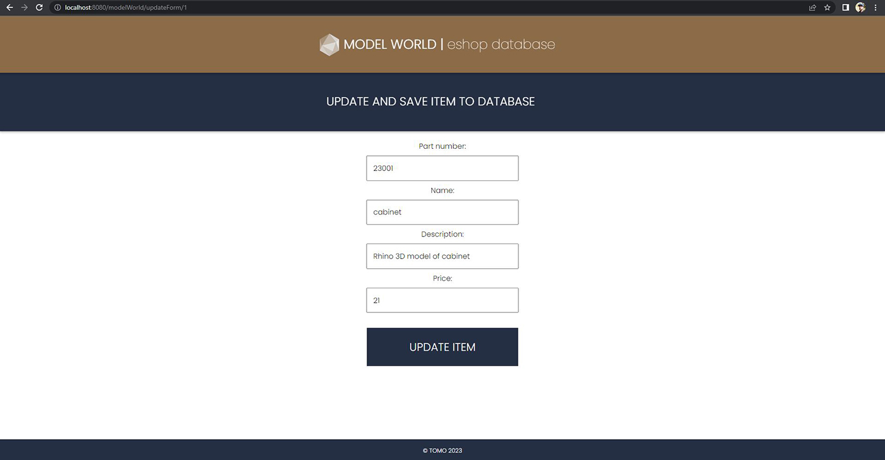
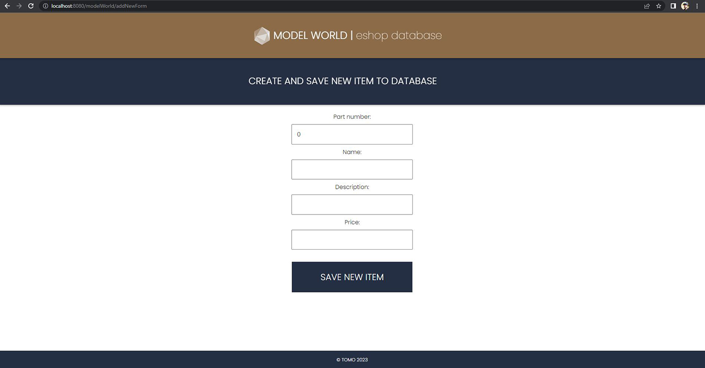
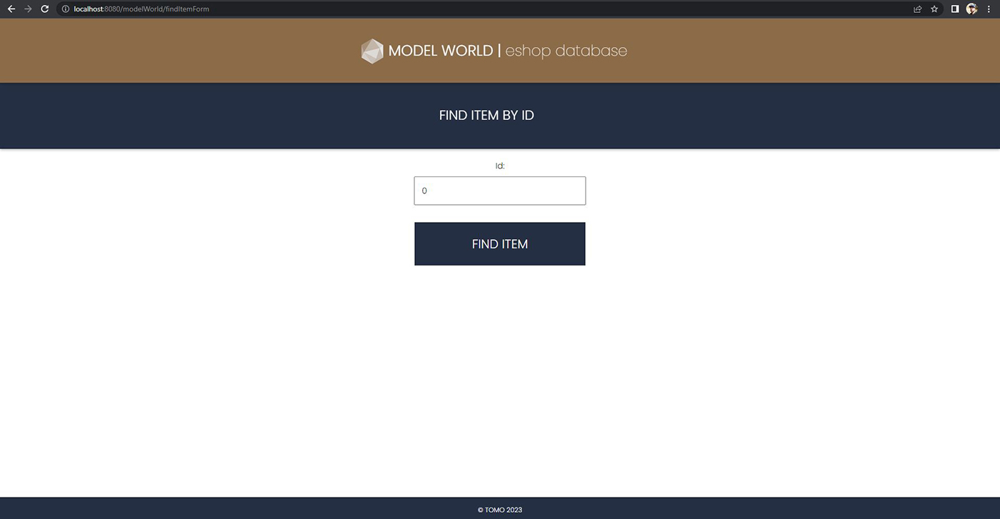

# **MODEL WORLD eshop application with frontend**
### Second project for Engeto academy 
#### Tomáš Mokrý | tomas.mokry@gmail.com | Discord Tomas M#0922
---
## **Project description**
The application is designed to be part of the fictional e-shop that offers 3D models. 
This part of application manage the list of products that the e-shop offers. 
Application is wrote in Java, it retrieve and modify the information via a REST API and use JDBC to communicate with mySQL database.
Front-end is created with Html and Css and Thymeleaf.

## **Model Item**
Application keeps the following information about each type of items:
* part number (part no)
* product name (name)
* textual description of the product (description)
* information on whether the product is currently on sale (is for sale)
* the price of the product (price).

## **REST API endpoints**
* load all available items
* load product by ID
* save item
* update item by ID
* delete out of sale items
* delete item
* show add new item form
* show update item form
* show find by id form
* show one item

## **Front-end previews**

---

---

---

